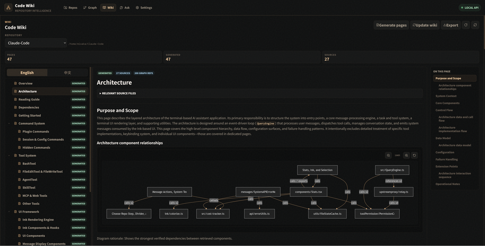

# CodeWiki

<p align="center">
  <strong>English</strong>
  &nbsp;·&nbsp;
  <a href="./docs/README.zh-CN.md">简体中文</a>
  &nbsp;·&nbsp;
  <a href="./docs/usage.md">Usage Guide</a>
  &nbsp;·&nbsp;
  <a href="./docs/typescript-backend.md">Architecture</a>
  &nbsp;·&nbsp;
  <a href="./docs/benchmarking.md">Benchmarks</a>
  &nbsp;·&nbsp;
  <a href="./docs/changelog.md">Changelog</a>
</p>

<p align="center">
  <a href="https://github.com/PorunC/CodeWiki/actions/workflows/test.yml"></a>
  <a href="./LICENSE"></a>
  <a href="https://github.com/PorunC/CodeWiki/stargazers"></a>
</p>

CodeWiki is a single-user code intelligence platform for repository analysis,
source-grounded graph retrieval, wiki generation, and local Q&A. The backend is now
a TypeScript/Fastify npm package in `backend`, with SQLite storage and a CLI that
can be installed globally from npm.

## Screenshots




## Highlights

- TypeScript backend package: `@misaka09982/code-wiki`, with `codewiki`,
  `codewiki-backend`, and `codewiki-mcp` npm binaries.
- Fastify HTTP API compatible with the existing React/Vite frontend routes under
  `/api`.
- SQLite persistence using the existing CodeWiki table names for repositories,
  analysis runs, graph nodes/edges, chunks, communities, and wiki pages.
- Repository scanning for local paths and Git URLs, with `.gitignore` handling and
  lightweight language detection.
- Deterministic graph analysis for files, definitions, imports, calls, source chunks,
  wiki drafts, source-grounded Q&A, and optional OpenAI-compatible LLM answers and
  wiki catalog/page generation.
- Docker image now runs the TypeScript backend on Node 22.

## Quick Start

Install from npm:

```bash
npm install -g @misaka09982/code-wiki
codewiki --version
```

Start the bundled web app and API:

```bash
codewiki serve
```

Open `http://127.0.0.1:8000`, register a repository, run analysis, then generate a
wiki or ask questions.

You can also run the complete flow from the CLI:

```bash
cd /path/to/your/repo
codewiki repos add . --name my-repo
codewiki analyze my-repo
codewiki ask "How does the main workflow fit together?" my-repo
```

For provider-backed wiki generation, configure catalog/page LLM profiles, then run
`codewiki wiki catalog my-repo` and `codewiki wiki pages my-repo`.

For Codex/Claude-generated wikis without CodeWiki LLM API credentials, use the
agent workflow:

```bash
codewiki wiki catalog-evidence my-repo --json
# Let the agent write catalog JSON with title/items, then:
codewiki wiki catalog-save my-repo --stdin --json < catalog.json
codewiki wiki plan my-repo --json
codewiki wiki evidence overview my-repo --json
```

List and read pages:

```bash
codewiki wiki list my-repo
codewiki wiki read overview my-repo
```

Refresh after code changes:

```bash
codewiki update my-repo
```

Most repository arguments accept an id, id prefix, registered name, path, or Git
URL. Use `--json` for machine-readable output.

Run with Docker Compose:

```bash
docker compose up --build
```

The npm package exposes the backend CLI and library exports. A source checkout is only
needed for frontend development, Docker builds, or local package work.

The package also includes a stdio MCP server:

```bash
codewiki-mcp
```

For editor integrations that should keep state inside the project, use lite MCP:

```bash
codewiki mcp --lite --path .
```

This creates and uses `.codewiki/codewiki-lite.sqlite3` in the selected project.

## Common Commands

```bash
codewiki repos add . --name my-repo
codewiki analyze .
codewiki wiki catalog-evidence .
codewiki wiki plan .
codewiki ask "How does the main workflow fit together?" my-repo
codewiki graph status my-repo
codewiki graph search "handler" my-repo
codewiki graphrag build my-repo
codewiki graphrag retrieve "startup flow" my-repo
```

Most repository arguments accept an id, id prefix, registered name, path, or Git URL.
Use `--json` for machine-readable output.

## Configuration

CodeWiki defaults to SQLite:

```bash
CODEWIKI_DATABASE_URL=sqlite:///./data/codewiki.sqlite3
```

The TypeScript backend accepts the previous Python SQLite URL form as well:
`sqlite+aiosqlite:///./data/codewiki.sqlite3`.

LLM-related environment variables are parsed and exposed by the settings API.
`codewiki ask`, the HTTP ask endpoint, and the MCP ask tool use deterministic local
answers by default, and automatically use an OpenAI-compatible chat completion
provider when the QA/default LLM profile is configured:

```bash
CODEWIKI_LLM__DEFAULT__MODEL=openai/gpt-4.1
CODEWIKI_LLM__DEFAULT__API_KEY="$OPENAI_API_KEY"
```

The CLI can create and edit the env file for you:

```bash
codewiki config --init
codewiki config --model openai/gpt-4.1 --api-key "$OPENAI_API_KEY"
codewiki config list
codewiki config models
```

For wiki catalogs, pages, or community naming, you can configure task-specific profiles:

```bash
CODEWIKI_LLM__PROFILES__CATALOG__MODEL=openai/gpt-4.1
CODEWIKI_LLM__PROFILES__CATALOG__API_KEY="$OPENAI_API_KEY"
CODEWIKI_LLM__PROFILES__PAGE__MODEL=openai/gpt-4.1
CODEWIKI_LLM__PROFILES__PAGE__API_KEY="$OPENAI_API_KEY"
CODEWIKI_LLM__PROFILES__COMMUNITY_SUMMARY__MODEL=openai/gpt-4.1
CODEWIKI_LLM__PROFILES__COMMUNITY_SUMMARY__API_KEY="$OPENAI_API_KEY"
```

## npm Usage Details

After `npm install -g @misaka09982/code-wiki`, these commands are available:

- `codewiki`: main CLI and web server.
- `codewiki-backend`: alias for the main CLI.
- `codewiki-mcp`: stdio MCP server.

Useful first commands:

```bash
codewiki --help
codewiki serve --host 127.0.0.1 --port 8000
codewiki repos list
codewiki config list
```

Import from Node.js:

```js
import { createServer, CodeWikiStore } from "@misaka09982/code-wiki";
import { CodeWikiMCPServer } from "@misaka09982/code-wiki/mcp";
```

## Documentation

- [Usage Guide](docs/usage.md): installation, Docker, database setup, wiki workflow,
  LLM profiles, CLI, MCP, HTTP API, and supported languages.
- [TypeScript Backend Architecture](docs/typescript-backend.md): current backend
  module boundaries, dependency ownership, package entrypoints, and CI/publish flow.
- [Benchmarking Guide](docs/benchmarking.md) and
  [Benchmark Report](docs/benchmark-report-2026-05-22.md): benchmark workflow and
  current results.
- [Changelog](docs/changelog.md): release history.

## Development

```bash
make install
make start
make lint
make typecheck
make test
make test-scripts
make lint-scripts
make build
make npm-pack
make npm-smoke
```

Default local URLs:

- TypeScript backend: `http://127.0.0.1:8000`
- Frontend: `http://127.0.0.1:5173`

### npm Package

The publishable package lives in `backend`:

```bash
cd backend
npm run verify
npm run build
npm pack --dry-run
npm run pack:smoke
```

Package entrypoints include the CLI binaries `codewiki`, `codewiki-backend`, and
`codewiki-mcp`, plus library exports `@misaka09982/code-wiki`,
`@misaka09982/code-wiki/server`, and `@misaka09982/code-wiki/mcp`.

## License

MIT
